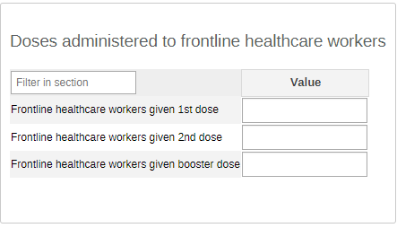
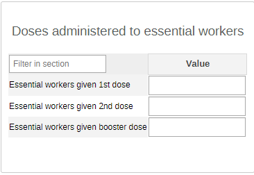
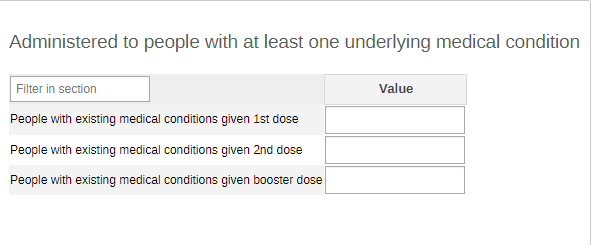
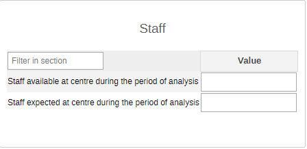
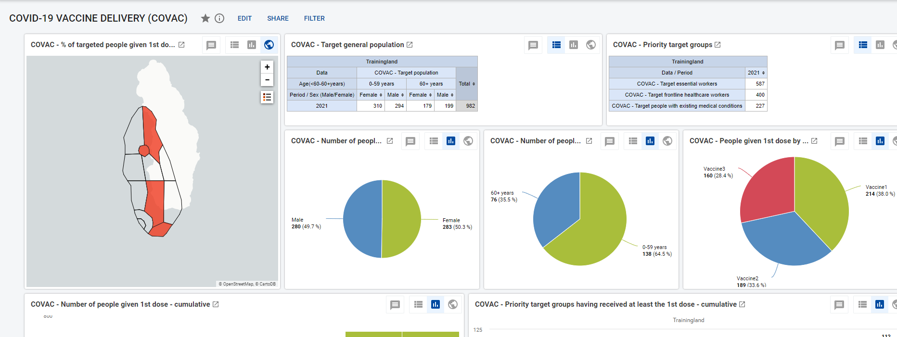

# COVID-19 Vaccine Delivery (COVAC) - Aggregate System Design Guide { #cvc-agg-design-100 }

## Introduction

The aggregate COVID-19 Vaccine Delivery (COVAC) metadata package has been developed as an installable solution for countries to update their DHIS2-based HMIS and immunization data systems [WHO Guidance on developing a national deployment and vaccination plan for COVID-19](https://www.who.int/publications/i/item/WHO-2019-nCoV-Vaccine_deployment-2020.1).

The COVAC Aggregate System Design document provides an overview of the design principles and global technical guidance used to develop a WHO standard metadata package for monitoring COVID-19 vaccination delivery. This document is intended for use by DHIS2 implementers at country and regional level to be able to support implementation and localisation of the package. The COVAC metadata package can be adapted to local needs and national guidelines.

This metadata package can be used for direct electronic reporting by vaccination site staff or higher level staff, or as a set of "target" metadata for aggregation of individual level data from electronic, mobile or paper-based collection tools. The analytics and dashboards included in these packages are designed to support the routine analysis and use of Covid-19 vaccine data at national and sub-national levels.

## Background

**This aggregate design has developed new aggregate reporting requirements from the** [**WHO Guidance on developing a national deployment and vaccination plan for COVID-19**](https://www.who.int/publications/i/item/WHO-2019-nCoV-Vaccine_deployment-2020.1)**.** The COVID-19 Vaccine Delivery digital data package was developed in response to an expressed need from countries to rapidly adapt a solution for managing the data originating from the planned/undertaken immunization efforts. UiO has developed the COVAC packages both for aggregated and individual data in order to enable countries to select the model that is most appropriate for their context given the workload and available resources. These models and their relative benefits/limitations are summarized below:

**Aggregate Data Package:**

- Enables daily reporting of key aggregate data points about vaccination activities and stock management.
- Low complexity, easy to implement. Most manageable when cases numbers are high, or wherever individual data entry is not possible due to the complexity of the tracker instance or to the burden of the vaccination activities compared to the data entry ones.

**Individual Data Package (Tracker):**

- Enrolls a case and tracks over time the vaccination schedules of the patients
- Highly granular data and multiple time dimensions for analysis, can support decentralized workflow, all events linked to the case.

**This document covers only the design of the aggregate package.** Separate system design documents are available for the DHIS2 Tracker package.

The aggregate package is designed to meet the most critical reporting requirements and analytical capacities for the monitoring of the vaccination activities.

The objectives of the COVAC aggregated package are:

1. to monitor the vaccination activities and their evolution within the target populations;
2. rapidly detect uptake trends as much as red flags as drop-out rates;
3. provide geographical information about the roll-out of the vaccination efforts;
4. provide information about stock management and quality data on waste.

The system design builds upon existing disease surveillance and vaccination guidelines principles and information system requirements that have been developed collaboratively between the WHO and UiO since 2017. The COVAC package was developed in alignment with the [WHO guidance on developing a national deployment and vaccination plan for COVID-19 vaccines](https://www.who.int/publications/i/item/WHO-2019-nCoV-Vaccine_deployment-2020.1), as per last update 16/01/2021. Note that this design may not necessarily reflect the latest available interim global guidance developed by WHO as updates may be released rapidly. National guidelines and policies may vary and it is recommended to adapt this package to local contexts.

## System Design Summary

In the development of this configuration package, an effort has been made to follow UiO's [general design principles](https://who.dhis2.org/documentation/general_design_principles.html) and a common [naming convention](https://who.dhis2.org/documentation/naming_convention.html).

The aggregate COVAC package includes:

1. Daily aggregate data set and data elements for key Covid-19 vaccination activities' reporting
2. Daily aggregate data set and data element for key stock management supervision
3. Annual aggregate dataset for target population
4. Core indicators for both datasets
5. Dashboard

The package captures a minimum number of data points that meet the current WHO reporting requirements. These will generate a core set of indicators feeding the dashboard for national and sub-national decision-makers to rapidly analyze and respond to odd trends and numbers.

**1)** **COVAC - Vaccination Report**

- Daily periodicity
- Purpose: Reporting of key COVID-19 vaccination efforts - data including doses, vaccine type, vial waste, AEFIs and core target population.

**2)** **COVAC - Vaccine stock**

- Daily periodicity
- Purpose: Reporting of key stock management data - doses, stock listing of vials and other core items

**3)** **COVAC - Target Population**

- Yearly periodicity
- Purpose: Target setting for general and priority populations to be offered the vaccination. This is different from the population estimate used to compute coverage.

It is recommended that the Vaccination Report and the Vaccine Stock datasets get assigned to Organisation Units at the lowest level of the health system feasible for reporting data, such as health facilities. The Target Population dataset could instead be assigned at district level or at the same level as the other two datasets depending on the availability of detailed population-related information. Digital data packages are optimized for Android data collection with the DHIS2 Capture App, free to download on the [GooglePlay store](https://play.google.com/store/apps/details?id=com.dhis2&amp;hl=en).

## Intended users

- Health facility users: capture and report key data on vaccine administration and waste at point of care.
- Logistics and Supply Managers: capture and report key data on the stock of vaccines and other items.
- National and local health authorities: monitor and analyse the evolution of the vaccination activities, and generate reports for regional and global reporting

## Datasets

### 1. COVAC - Vaccination Report Data Entry Form

#### Section 1: Doses administered by vaccine/age/sex

Data should be entered for all the vaccinated people by number of received dose (1st, 2nd, and booster), by sex (male and female), by age groups (0-59 years and 60+ years) and by type of vaccine administered (Vaccine 1, 2, 3 as place holders for the name of the used vaccine).

#### Section 2: Doses administered to front line healthcare workers

This section captures the number of doses administered to a key population group - in this case front line HCWs. It is important to note that this is a subdivision of the first section, which means that the levels of disaggregation are not mutually exclusive.

#### Section 3: Doses administered to essential workers

This section captures the number of doses administered to key population groups - in this case essential workers. It is important to note that this is a subdivision of the first section, which means that the levels of disaggregation are not mutually exclusive.

#### Section 4: Doses administered to people wit at least one underlying medical condition

This section captures the number of doses administered to key population groups - in this case people with at least one underlying condition determined to be at significantly higher risk of severe disease or death. It is important to note that this is a subdivision of the first section, which means that the levels of disaggregation are not mutually exclusive.

#### Section 5: Doses discarded/wasted by reason

Waste is a core parameter to monitor quality of care and of supply chain. This section tracks doses wasted while being administered by condition of the vial and reasons for discarding them.

#### Section 6: AEFIs by vaccine and severity

This section provides an overview of the Adverse Events Following Immunization recorded by severity. Note that the reporting of AEFIs needs to be followed by a full investigation as per Countries' Guidelines.

#### Section 7: Staff workload

This section is aimed at providing a snapshot of the availability of medical staff during the roll-out of the vaccination activities.

### 2.  - Vaccine Stock Data Entry Form

#### Section 1: Doses in a vaccine vial

This is a &quot;read-only&quot; section that will be pre-configured using constants and indicators to display for doses in a vaccine vial. As countries will be likely to use different vaccines, they need to specify how many doses can be extracted in each vial in order to create constants for the calculations of doses vs vials in the next section. This should be updated as explained in the section for Constants metadata.

#### Section 2: Vaccine Stock Status

The vaccines are divided by the different categories needed to monitor the stock. The doses and the closing balance will be automatically calculated. A predictor will automatically fill-in the opening balance of each reporting period copying the final stock at hand from the previous period.

#### Section 3: Stock status of other items

Similarly to section 2, this section provides the core info for the management of other items needed during vaccination activities (e.g. syringes, cold boxes). The closing balance will be automatically calculated. A predictor will automatically fill-in the opening balance of each reporting period copying the final stock at hand from the previous period.

### 3. COVAC - Target population (Annual) Data Entry Form

#### Section 1: Total target population

This section requires the population estimates by sex and age groups.

#### Section 2: Targeted priority groups

As mentioned in the first dataset, this is a sub-grouping of the first section of this dataset. This means that the two sections are not mutually exclusive - the totals entered in this section are meant to be included also in the total by age and sex.

## Customizing Data Entry Forms

The Stock data entry form in this package contains custom forms used to improve the usability of the form for data entry. As Implementers make required edits to the metadata, they may need to edit the custom form to meet the needs by following the DHIS2 User manual: [https://docs.dhis2.org/2.33/en/user/html/dhis2\_user\_manual\_en\_full.html#manage\_customform](https://docs.dhis2.org/2.33/en/user/html/dhis2_user_manual_en_full.html#manage_customform)

## Data Elements

The following data elements have been created and used to design the dataSet and all the related metadata. All COVAC data elements are assigned to the data element Group &#39;COVAC - Vaccination&#39;.

| **Target Population dataSets** | |
| --- | --- |
| **Name** | **Disaggregation** |
| COVAC - Target essential workers | |
| COVAC - Target frontline healthcare workers | |
| COVAC - Target people with at least one underlying medical condition | |
| COVAC - Target population | Age(\<60-60+years)/Sex |
| **Vaccination Report dataSet** | |
| **Name** | **Disaggregation** |
| COVAC - People given 1st dose | Age(<60-60+years)/Sex/COVID19 Vaccine |
| COVAC - People given 2+ dose | Age(\<60-60+years)/Sex/COVID19 Vaccine |
| COVAC - People given last dose | Age(\<60-60+years)/Sex/COVID19 Vaccine |
| COVAC - Essential workers given 1st dose | |
| COVAC - Essential workers given 2+ dose | |
| COVAC - Essential workers given last dose | |
| COVAC - Frontline healthcare workers given 1st dose | |
| COVAC - Frontline healthcare workers given 2+ dose | |
| COVAC - Frontline healthcare workers given last dose | |
| COVAC - People with at least one underlying medical conditions given 1st dose | |
| COVAC - People with at least one underlying medical conditions given 2+ dose | |
| COVAC - People with at least one underlying medical conditions given last dose | |
| COVAC - AEFIs by vaccine and severity | COVID19 Vaccine/AEFI Severity |
| COVAC - Doses discarded by reasons | Vial condition/Wastage reasons |
| COVAC - Staff available at centre today | |
| COVAC - Staff expected at centre today | |
| **Vaccine stock dataSet** | |
| COVAC - Discarded cold boxes | |
| COVAC - Discarded safety boxes | |
| COVAC - Discarded syringes with needle 1ml | |
| COVAC - Discarded diluent | |
| COVAC - Discarded dilution syringes | |
| COVAC - Discarded vaccination cards | |
| COVAC - Discarded vials | COVID19 Vaccine |
| COVAC - Distributed cold boxes | |
| COVAC - Distributed safety boxes | |
| COVAC - Distributed syringes with needle 1ml | |
| COVAC - Distributed diluent| |
| COVAC - Distributed dilution syringes| |
| COVAC - Distributed vaccination cards | |
| COVAC - Distributed vials | COVID19 Vaccine |
| COVAC - Opening balance cold boxes | |
| COVAC - Opening balance safety boxes | |
| COVAC - Opening balance syringes with needle 1ml | |
| COVAC - Opening balance diluent | |
| COVAC - Opening balance dilution syringes | |
| COVAC - Opening balance vaccination cards | |
| COVAC - Opening balance vials | COVID19 Vaccine |
| COVAC - Received cold boxes | |
| COVAC - Received safety boxes | |
| COVAC - Received syringes with needle 1ml | |
| COVAC - Received diluent | |
| COVAC - Received dilution syringes | |
| COVAC - Received vaccination cards | |
| COVAC - Received vials | COVID19 Vaccine |
| COVAC - Redistributed cold boxes | |
| COVAC - Redistributed safety boxes | |
| COVAC - Redistributed syringes with needle 1ml | |
| COVAC - Redistributed diluent | |
| COVAC - Redistributed dilution syringes | |
| COVAC - Redistributed vaccination cards | |
| COVAC - Redistributed vials | COVID19 Vaccine |
| COVAC - Stock on hand cold boxes | |
| COVAC - Stock on hand safety boxes | |
| COVAC - Stock on hand syringes with needle 1ml | |
| COVAC - Stock on hand diluent | |
| COVAC - Stock on hand dilution syringes | |
| COVAC - Stock on hand vaccination cards | |
| COVAC - Stock on hand vials | COVID19 Vaccine |
| COVAC - Stockout days cold boxes | |
| COVAC - Stockout days safety boxes | |
| COVAC - Stockout days syringes with needle 1ml | |
| COVAC - Stockout days diluent | |
| COVAC - Stockout days dilution syringes | |
| COVAC - Stockout days vaccination cards | |
| COVAC - Stockout days vaccine1 | |
| COVAC - Stockout days vaccine2 | |
| COVAC - Stockout days vaccine3 | |

## Data Validation Rules

The following data validation rules have been configured to validate data across the three data sets as outlined in the on the table below. Currently all data sets allow completion even when the rules fail but further configurations can be made to enforce the rules and additional rules can be created by implementers as deemed necessary.

| **COVAC - Vaccine stock dataSet** |||||
| --- | --- | --- | --- | --- |
| *Name* | *Instruction* | *Left side* | *Operator* | *Right side* |
| COVAC - Distributed+Redistributed+Discarded Vs Opening balance+Received cold boxes | Distributed+Redistributed+Discarded should be less than or equal to Opening balance+Received cold boxes | Distributed+Redistributed+Discarded cold boxes | less\than\or\equal\to | Opening balance + Received cold boxes |
| COVAC - Distributed+Redistributed+Discarded Vs Opening balance+Received syringes|Distributed+Redistributed+Discarded should be less than or equal to Opening balance+Received syringes|Distributed+Redistributed+Discarded syringes|less\than\or\equal\to|Opening balance + Received syringes|
| COVAC - Distributed+Redistributed+Discarded Vs Opening balance+Received vaccination cards|Distributed+Redistributed+Discarded should be less than or equal to Opening balance+Received vaccination cards|Distributed+Redistributed+Discarded vaccination cards|less\than\or\equal\to|Opening balance + Received|
| COVAC - Distributed+Redistributed+Discarded Vs Opening balance+Received vials|Distributed+Redistributed+Discarded should be less than or equal to Opening balance+Received vials|Distributed+Redistributed+Discarded vials|less\than\or\equal\to|Opening balance + Received|
| COVAC - Doses discarded by reasons Vs discarded stock|Doses discarded by reasons should be less than or equal to discarded stock|Doses discarded by reasons|less\than\or\equal\to|Discarded stock|
| COVAC - Stock on hand Vs Opening balance + Received cold boxes|Stock on hand should be less than or equal to (Opening balance + Received) cold boxes|Stock on hand cold boxes|less\than\or\equal\to|Opening balance + Received cold boxes|
| COVAC - Stock on hand Vs Opening balance + Received safety boxes|Stock on hand should be less than or equal to (Opening balance + Received) safety boxes|Stock on hand safety boxes|less\than\or\equal\to|Opening balance + Received safety boxes|
| COVAC - Stock on hand Vs Opening balance + Received syringes with needle 1ml|Stock on hand should be less than or equal to (Opening balance + Received) syringes with needle 1ml|Stock on hand syringes with needle 1ml|less\than\or\equal\to|Opening balance + Received syringes with needle 1ml|
| COVAC - Stock on hand Vs Opening balance + Received vaccination cards|Stock on hand should be less than or equal to (Opening balance + Received) vaccination cards|Stock on hand vaccination cards|less\than\or\equal\to|Opening balance + Received vaccination cards|
| COVAC - Stock on hand Vs Opening balance + Received vials|Stock on hand should be less than or equal to (Opening balance + Received) vials|Stock on hand vials|less\than\or\equal\to|Opening balance + Received|

| *COVAC - Vaccination Report* |||||
| --- | --- | --- | --- | --- |
| *Name* | *Instruction* | *Left side* | *Operator* | *Right side* |
| COVAC - Essential workers given 1st dose Vs People given 1st dose | Essential workers given 1st dose should be less than or equal to People given 1st dose | Essential workers given 1st dose | less\than\or\equal\to | People given 1st dose |
| COVAC - Essential workers given 2nd dose Vs People given 2nd dose | Essential workers given 2+ dose should be less than or equal to People given 2nd dose | Essential workers given 2nd dose | less\than\or\equal\to | People given 2nd dose |
| COVAC - Essential workers given booster dose Vs People given booster dose | Essential workers given booster dose should be less than or equal to People given booster dose | Essential workers given booster dose | less\than\or\equal\to | People given booster dose |
| COVAC - Frontline healthcare workers given 1st dose Vs People given 1st dose | Frontline healthcare workers given 1st dose should be less than or equal to People given 1st dose | Frontline healthcare workers given 1st dose | less\than\or\equal\to | People given 1st dose |
| COVAC - Frontline healthcare workers given 2nd dose Vs People given 2+ dose|Frontline healthcare workers given 2nd dose should be less than or equal to People given 2nd dose | Frontline healthcare workers given 2nd dose | less\than\or\equal\to | People given 2nd dose |
| COVAC - Frontline healthcare workers given last dose Vs People given booster dose | Frontline healthcare workers given booster dose should be less than or equal to People given booster dose | Frontline healthcare workers given booster dose | less\than\or\equal\to | People given booster dose |
| COVAC - People with underlying medical conditions given 1st dose Vs People given 1st dose | People with underlying medical conditions given 1st dose should be less than or equal to People given 1st dose | People with underlying medical conditions given 1st dose | less\than\or\equal\to | People given 1st dose |
| COVAC - People with underlying medical conditions given 2+ dose Vs People given 2nd dose | People with underlying medical conditions given 2nd dose should be less than or equal to People given 2nd dose | People with underlying medical conditions given 2nd dose | less\than\or\equal\to | People given 2nd dose |
| COVAC - People with underlying medical conditions given booster dose Vs People given booster dose | People with underlying medical conditions given booster dose should be less than or equal to People given booster dose | People with underlying medical conditions given booster dose | less\than\or\equal\to | People given booster dose |
| COVAC - Staff available at PoC Vs Staff expected at PoC| Staff available at PoC should be less than or equal to staff expected at PoC | Staff available at PoC | less\than\or\equal\to | Staff expected at PoC |

| *COVAC - Target Population* |||||
| --- | --- | --- | --- | --- |
| *Name* | *Instruction* | *Left side* | *Operator* | *Right side* |
| COVAC - Frontline health workers+Essential workers+People with underlying medical conditions Vs Target population | Frontline health workers+Essential workers+People with underlying medical conditions should be less than or equal to Target population | Frontline health workers+Essential workers+People with underlying medical conditions | less\than\or\equal\to | Target population |

## Constants

The following constants have been created to allow for one-time capture of number doses in a vial for each vaccine. Once a country agrees on the vaccines to be administered, these constants should be updated by the implementers with the correct name of the vaccine and value of doses in vials for each. Currently vaccine 1, vaccine 2 and vaccine 3 have been used for the names with values 4, 5 and 6 respectively. This could be updated to; for example Pfizer, Morderna and AstraZeneca with values 4, 6 and 5 respectively.

| **Name** | **Shortname** | **Value** |
| --- | --- | --- |
| COVAC - Doses in a vial - Vaccine 1 | Doses in a vial - Vaccine 1 | 4 |
| COVAC - Doses in a vial - Vaccine 2 | Doses in a vial - Vaccine 2 | 5 |
| COVAC - Doses in a vial - Vaccine 3 | Doses in a vial - Vaccine 3 | 6 |

## Indicators

From the data captured, we can calculate at least the following indicators -- many of which are recommended by the WHO for monthly reporting-- and present them in a dashboard. All COVAC indicators are assigned to the Indicator Group "COVAC - Vaccination". Here are some of the core indicators configured in the metadata.

| **Vaccination monitoring indicators** |||
| --- | --- | --- |
| **Name** | **Numerator** | **Denominator** |
| Dropout rates among all people targeted | Given 1st dose - Given 2nd dose | Given 1st dose |
| Dropout rates among essential workers(%) | Given 1st dose - Given 2nd dose | Given 1st dose |
| Dropout rates among front line healthcare workers(%) | Given 1st dose - Given 2nd dose | Given 1st dose |
| Dropout rates among people with underlying medical conditions(%) | Given 1st dose - Given 2nd dose | Given 1st dose |
| Proportion of staff available | Staff available | Expected staff |
| Proportion of target essential workers given 1st dose | Target essential workers who received 1st dose | Target essential workers |
| Proportion of target essential workers given 2nd dose | Target essential workers given 2nd dose | Target essential workers |
| Proportion of target front line healthcare workers given 1st dose | Target front line healthcare workers given 1st dose | Target front line healthcare workers |
| Proportion of target front line healthcare workers given booster dose | Target front line healthcare workers given booster dose | Target front line healthcare workers |
| Proportion of target people given 1st dose | Target people given 1st dose | Target population |
| Proportion of target people given last dose | Target people given booster dose | Target population |
| Proportion of target people with underlying medical conditions given 1st dose | Target people with existing conditions given 1st dose | Target people with existing medical conditions |
| Proportion of target people with underlying medical conditions given booster dose | Target people with existing conditions given booster dose | Target people with underlying medical conditions |
| Vaccine 1 uptake (%) | Vaccine 1 doses given | Total doses of all vaccines given |
| Vaccine 2 uptake (%) | Vaccine 2 doses given | Total doses of all vaccines given |
| Vaccine 3 uptake (%) | Vaccine 3 doses given | Total doses of all vaccines given |
| Closed vials wastage (%) | Closed vial doses discarded | Discarded doses |
| Opened vials wastage (%) | Opened vial doses discarded | Discarded doses |
| Vaccination reporting rates | Actual reports received | Expected reports |
| Vaccination reporting rates on time | Actual reports received on time | Actual reports received |

| **Stock monitoring indicators** |||
| --- | --- | --- |
| **Name** | **Numerator** | **Denominator** |
| Vaccine stock reporting rates | Actual reports received | Expected reports |
| Vaccine stock reporting rates on time | Actual reports received on time | Actual reports received |
| Vaccine usage rate (%) | Distributed vials | Used vials |
| Wastage rate (%) | Discarded doses | Used doses=(Opening balance+Received)-(Redistributed+Stock on hand) |
| Stock discrepancy rate (%) | Closing balance-Stock on hand | Stock on hand |
| Used vials | (Opening balance+Received)-(Redistributed+Stock on hand) | 1 |
| Closing balance - Vaccine1 doses | (Opening balance+Received)-(Distributed+Redistributed+Discarded) | 1 |
| Closing balance - Vaccine1 vials | (Opening balance+Received)-(Distributed+Redistributed+Discarded) | 1 |
| Closing balance - Vaccine2 doses | (Opening balance+Received)-(Distributed+Redistributed+Discarded) | 1 |
| Closing balance - Vaccine2 vials | (Opening balance+Received)-(Distributed+Redistributed+Discarded) | 1 |
| Closing balance - Vaccine3 doses | (Opening balance+Received)-(Distributed+Redistributed+Discarded) | 1 |
| Closing balance - Vaccine3 vials | (Opening balance+Received)-(Distributed+Redistributed+Discarded) | 1 |
| Closing balance cold boxes | (Opening balance+Received)-(Distributed+Redistributed+Discarded) | 1 |
| Closing balance safety boxes | (Opening balance+Received)-(Distributed+Redistributed+Discarded) | 1 |
| Closing balance syringes with needle 1ml | (Opening balance+Received)-(Distributed+Redistributed+Discarded) | 1 |
| Closing balance vaccination cards | (Opening balance+Received)-(Distributed+Redistributed+Discarded) | 1 |
| Closing balance vials | (Opening balance+Received)-(Distributed+Redistributed+Discarded) | 1 |
| Closing balance diluent | (Opening balance+Received)-(Distributed+Redistributed+Discarded) | 1 |
| Closing balance dilution syringes | (Opening balance+Received)-(Distributed+Redistributed+Discarded) | 1 |

## Dashboard

The package includes a predefined dashboard with the minimum amount of information that should be available at glance during vaccination activities.

The first part of the dashboard summarizes the core indicators - vaccine uptake, distribution, dropouts, AEFIs.

The second part of the dashboard is instead dedicated to the overview of the stock management. Here the user can have an overview of the stock at hand, reporting, and waste.

## User Groups

The following user groups are included in the metadata package:

1. COVAC admin -- intended for system admins to have metadata edit rights
2. COVAC data capture -- intended for data entry staff to have access to capture data
3. COVAC access -- intended for users such as analytics users who should be able to view the data, but not edit metadata.

Please refer to the installation guidance for more information.

## Special considerations for installation

Installation of this package will largely follow the general installation guide for aggregate packages as outlined: [https://who.dhis2.org/documentation/installation\_guide\_complete.html](https://who.dhis2.org/documentation/installation_guide_complete.html)

However special considerations should be made to update the vaccines items once they have been agreed upon by the country or agencies managing the vaccination program.

Currently, **"placeholder-vaccine-names"** have been used and these can be updated ( find/replace) in the metadata json file before uploading into the system as illustrated in the example on the table below;

| Placeholder text | Actual text (for example) | Metadata associated |
| --- | --- | --- |
| Vaccine1 | Pfizer | Contants, dataElements, categoryOptions, CategoryCombos, categoryOptionGroups, indicators, dataEntryForms |
| Vaccine2 | Moderna | Contants, dataElements, categoryOptions, CategoryCombos, categoryOptionGroups, indicators, dataEntryForms |
| Vaccine3 | Astrazenca | Contants, dataElements, categoryOptions, CategoryCombos, categoryOptionGroups, indicators and dataEntryForms |
| VACCINE1 | PFIZER | dataElements, categoryOptions and indicators |
| VACCINE2 | MODERNA | dataElements, categoryOptions and indicators |
| VACCINE3 | ASTRAZENCA | dataElements, categoryOptions and indicators |

## References

- Guidance on developing a national deployment and vaccination plan for COVID-19, World Health Organization [https://www.who.int/publications/i/item/WHO-2019-nCoV-Vaccine\_deployment-2020.1](https://www.who.int/publications/i/item/WHO-2019-nCoV-Vaccine_deployment-2020.1)
